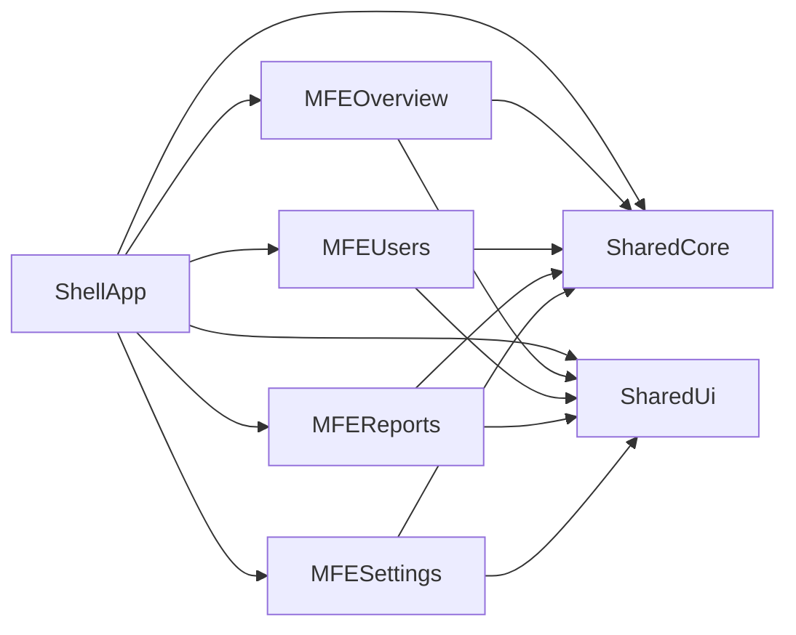

# PulseBoard - Multi-tenant Analytics Dashboard

## Project overview
PulseBoard is a React + TypeScript micro frontend dashboard that models how multi-tenant SaaS products are built in production. The shell app owns auth, routing, and workspace context while domain MFEs (overview, users, reports, settings) are independently deployable.

## Problem statement
Traditional single-frontend dashboards become hard to scale when multiple teams own different domains. This project demonstrates module ownership boundaries, tenant-safe data access, and role-based UI constraints while maintaining a cohesive UX.

## Why micro frontends
- Domain ownership by module (`mfe-overview`, `mfe-users`, `mfe-reports`, `mfe-settings`)
- Independent deployability via Module Federation
- Smaller route-level bundles with lazy remote loading
- Reduced coupling through shared contract packages

## Architecture diagram


## Module boundaries
- `apps/shell-app`: auth/session bootstrap, protected routes, RBAC menu gating, workspace switcher.
- `apps/mfe-overview`: KPI widgets and chart surfaces.
- `apps/mfe-users`: invite flow, searchable/paginated user list, optimistic status updates.
- `apps/mfe-reports`: report list, saved filter behavior, export UX.
- `apps/mfe-settings`: org settings, billing controls, audit log.

## Shared vs local responsibility
- Shared (`packages/shared-core`, `packages/shared-ui`)
  - Auth/session types and persistence
  - RBAC permission helpers
  - Tenant-aware API/query scoping helpers
  - Reusable UI atoms (card, button, badge)
- Local (each MFE)
  - Page-specific view state and feature hooks
  - Domain forms and filtering logic
  - Module-level presentation

## Auth and RBAC approach
- Session is persisted in `localStorage` and includes `role`, `activeOrgId`, and `planTier`.
- Shell route guards protect authenticated pages.
- Navigation and route access use `hasPermission()` from `shared-core`.
- Workspace switching updates active tenant context and plan tier.

## State management decisions
- TanStack Router for typed route hierarchy and protected routes.
- TanStack Query provider is configured in shell for scalable server-state patterns.
- Zustand handles lightweight client session state.

## Performance optimizations
- Remote MFEs are lazy loaded with `React.lazy` + suspense fallback.
- Module Federation splits bundles per domain module.
- Search in users module is debounced.
- User list is paginated to reduce render volume.
- Shared packages reduce repeated module code.

## Tradeoffs
- MFEs add setup complexity (shared dependency management and runtime contracts).
- Mocked data is enough for frontend architecture, but backend integration is intentionally minimal.
- A centralized design system package improves consistency but requires version discipline.
- Module Federation automatic DTS generation is disabled (`dts: false` in Vite config) because the DTS plugin targets TypeScript 5 peer ranges while this repo uses TypeScript 6. Remote types are declared manually in the shell (`src/types/remotes.d.ts`).

## Future improvements
- Add MSW handlers per tenant domain for realistic API simulation.
- Add virtualization for very large tables.
- Add route-level error boundaries and retry controls.
- Add E2E coverage for login, RBAC, and workspace switching.

## Tech stack
- React, TypeScript, Vite
- TanStack Router, TanStack Query
- Zustand
- Tailwind CSS
- Vite Module Federation plugin
- React Hook Form + Zod
- Recharts

## Getting started
```bash
pnpm install
pnpm --filter "./apps/*" dev
```

Run shell and each MFE on:
- Shell: `http://localhost:4100`
- Overview: `http://localhost:4101`
- Users: `http://localhost:4102`
- Reports: `http://localhost:4103`
- Settings: `http://localhost:4104`

## Deploying to Vercel

Deploy as 5 separate Vercel projects (one per app):
- `apps/shell-app`
- `apps/mfe-overview`
- `apps/mfe-users`
- `apps/mfe-reports`
- `apps/mfe-settings`

For each Vercel project:
1. Set the root directory to the app folder (for example `apps/mfe-overview`).
2. Keep the framework preset as `Vite`.
3. Use this build command:
   - `pnpm --filter <app-name> build`
4. Use this output directory:
   - `dist`

Suggested build commands:
- Shell: `pnpm --filter shell-app build`
- Overview: `pnpm --filter mfe-overview build`
- Users: `pnpm --filter mfe-users build`
- Reports: `pnpm --filter mfe-reports build`
- Settings: `pnpm --filter mfe-settings build`

### Shell environment variables

The shell app loads remote MFEs from environment variables (with localhost fallbacks for local dev). In the `shell-app` Vercel project, set:

- `VITE_MFE_OVERVIEW_REMOTE_ENTRY=https://<overview-domain>/remoteEntry.js`
- `VITE_MFE_USERS_REMOTE_ENTRY=https://<users-domain>/remoteEntry.js`
- `VITE_MFE_REPORTS_REMOTE_ENTRY=https://<reports-domain>/remoteEntry.js`
- `VITE_MFE_SETTINGS_REMOTE_ENTRY=https://<settings-domain>/remoteEntry.js`

An example template is available at `apps/shell-app/.env.example`.

### Demo flow

- Share only the `shell-app` URL for demos.
- Keep all 4 MFEs deployed and reachable at their `remoteEntry.js` URLs.
- Shell handles routing and lazy loading of each remote module.
